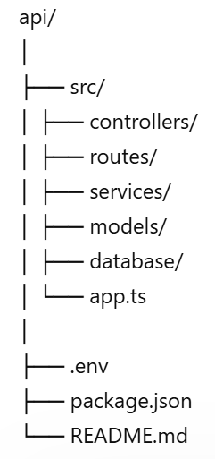

## 📌 Arquitetura do Projeto

Este projeto foi dividido em dois repositórios independentes: **mobile** e **API**, seguindo boas práticas de desenvolvimento moderno.

A separação foi adotada para permitir **deploy independente**, facilitando a manutenção e evolução de cada parte do sistema sem impactar a outra. Enquanto a API pode ser atualizada com frequência no servidor, o aplicativo mobile mantém seu ciclo próprio de build e distribuição.

Além disso, essa abordagem melhora a **organização do código**, aumenta a **segurança** (especialmente no gerenciamento de variáveis sensíveis) e possibilita a **reutilização da API** em outros clientes, como aplicações web.

Essa estrutura reflete um cenário real de mercado, tornando o projeto mais escalável, profissional e alinhado com práticas utilizadas em ambientes de produção.

## Estrutura ideal


## InfraCow API

API REST do projeto InfraCow, desenvolvida em Node.js com Express, Sequelize e PostgreSQL.

## Tecnologias

- Node.js
- Express
- PostgreSQL
- Sequelize
- JWT
- bcrypt

## Pré-requisitos

- Node.js 22 ou superior
- PostgreSQL disponível localmente ou em um serviço gerenciado
- Arquivo `.env` configurado com as variáveis do projeto

## Variáveis de ambiente

Use o arquivo [.env.example](.env.example) como base.

```env
DB_HOST=localhost
DB_PORT=5432
DB_USER=usuario_banco
DB_PASSWORD=senha_usuario_banco
DB_NAME=nome_banco
PORT=3000
JWT_SECRET=chave_para_autenticacao
DATABASE_URL=
DB_SSL=false
```

Observações:

- `JWT_SECRET` é obrigatório para login e autenticação.
- `PORT` é opcional localmente; no Render ela normalmente é fornecida pela plataforma.
- Você pode usar `DATABASE_URL` para conectar direto em bancos como Supabase.
- Se estiver usando `DB_HOST`, `DB_USER` e `DB_PASSWORD`, ajuste `DB_SSL=true` quando o banco exigir SSL.

## Instalação

```bash
npm install
```

## Como rodar localmente

1. Crie o arquivo `.env` na raiz do projeto.
2. Preencha as variáveis com os dados do seu PostgreSQL.
3. Inicie a API:

```bash
npm start
```

Para desenvolvimento com reinício automático:

```bash
npm run dev
```

## Validação rápida

Depois que a API subir, teste o endpoint de saúde:

```bash
GET /health
```

Resposta esperada:

```json
{ "status": "ok" }
```

## Autenticação

As rotas protegidas exigem o header:

```http
Authorization: Bearer SEU_TOKEN_JWT
```

## Rotas principais

### Usuário

- `POST /usuario` cria usuário
- `POST /login` autentica e retorna JWT
- `GET /usuarios` busca o usuário logado
- `PUT /perfil` atualiza dados do usuário logado

### Fazendas

- `GET /fazendas`
- `POST /fazendas`
- `GET /fazendas/:id`
- `PUT /fazendas/:id`
- `DELETE /fazendas/:id`

### Animais

- `GET /animais`
- `POST /animais`
- `GET /animais/:id`
- `PUT /animais/:id`
- `DELETE /animais/:id`

### Medições

- `GET /medicao`
- `POST /medicao`
- `GET /medicao/:id`
- `PUT /medicao/:id`
- `DELETE /medicao/:id`

## Deploy no Render

### Opção recomendada com Supabase

1. Crie um projeto no Supabase.
2. Copie a `DATABASE_URL` do projeto.
3. No Render, cadastre `DATABASE_URL` e `JWT_SECRET` nas variáveis de ambiente.
4. Se o projeto não conectar, confirme que a URL é a de conexão direta do PostgreSQL e não a URL da API do Supabase.

### 1. Banco de dados

1. Crie um serviço PostgreSQL no Render.
2. Copie as credenciais geradas pela plataforma.
3. Use esses dados nas variáveis `DB_HOST`, `DB_USER`, `DB_PASSWORD` e `DB_NAME`.

### 2. Serviço web

1. Crie um Web Service apontando para este repositório.
2. Configure o ambiente como Node.js.
3. Use o comando de build padrão da plataforma ou apenas deixe o `npm install` ser executado.
4. Configure o start command como:

```bash
npm start
```

### 3. Variáveis no Render

Adicione as mesmas variáveis do `.env` no painel do serviço:

- `DB_HOST`
- `DB_PORT`
- `DB_USER`
- `DB_PASSWORD`
- `DB_NAME`
- `JWT_SECRET`
- `PORT`
- `DATABASE_URL`
- `DB_SSL`

### 4. Porta

O Render injeta a porta automaticamente via `PORT`. O código já usa essa variável, então não é preciso fixar uma porta manualmente no painel.

## Fluxo recomendado de checagem

1. Subir o PostgreSQL.
2. Configurar o `.env` local.
3. Rodar `npm start`.
4. Testar `/health`.
5. Testar login e rotas protegidas com o header `Authorization`.

## Status de Implementação

### ✅ Implementado
- Autenticação com JWT
- CRUD de Usuários
- CRUD de Fazendas
- CRUD de Animais
- CRUD de Medições
- Endpoint de Saúde `/health`
- CORS ativado
- Variáveis de ambiente
- Deploy no Render
- PostgreSQL no Render

### 📝 Documentação

Veja a [API-DOCUMENTATION.md](API-DOCUMENTATION.md) para exemplos completos de uso com cURL.

**Resumo rápido:**
- POST `/usuario` - Criar usuário
- POST `/login` - Autenticar
- GET `/fazendas` - Listar fazendas (requer JWT)
- POST `/fazendas` - Criar fazenda (requer JWT)
- GET `/animais` - Listar animais (requer JWT)
- POST `/animais` - Registrar animal (requer JWT)
- GET `/medicao` - Listar medições (requer JWT)
- POST `/medicao` - Registrar medição (requer JWT)

Todas as operações (GET, POST, PUT, DELETE) funcionam para cada recurso.

## Observações técnicas

- O projeto usa `sequelize.sync()` na inicialização para criar/sincronizar tabelas.
- Em produção, o ideal é evoluir isso para migrations se o esquema crescer.
- O middleware de autenticação foi ajustado para aceitar `Authorization` corretamente.
- CORS está habilitado para aceitar requisições de qualquer origem.
- O banco PostgreSQL está hospedado no Render.
